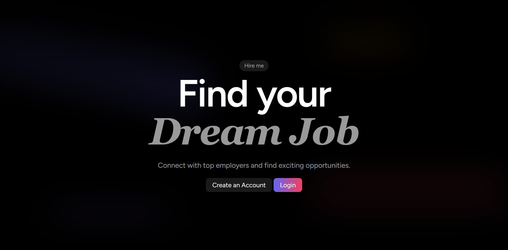
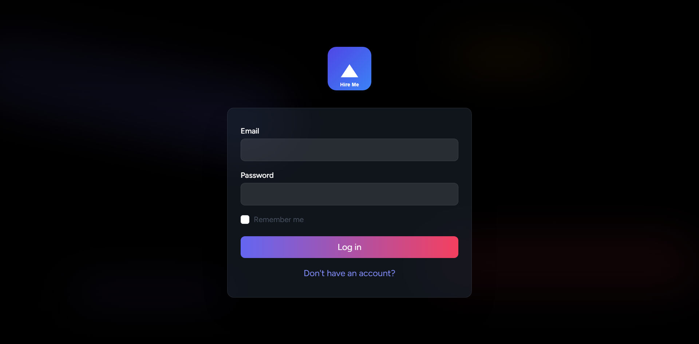
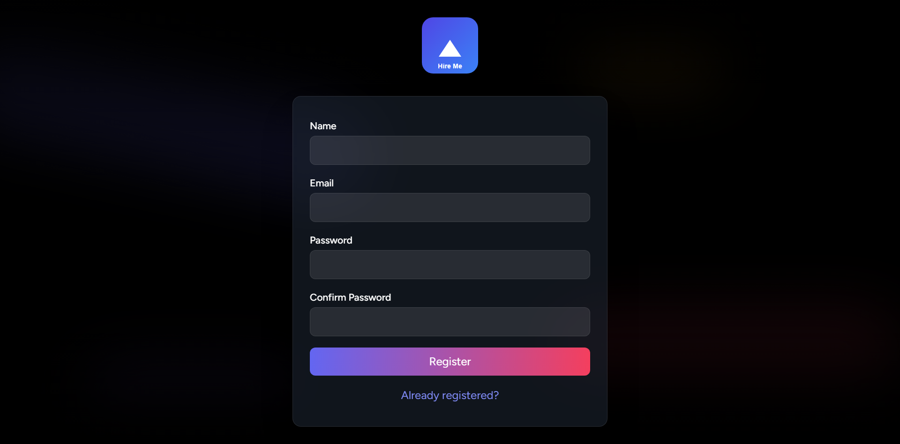
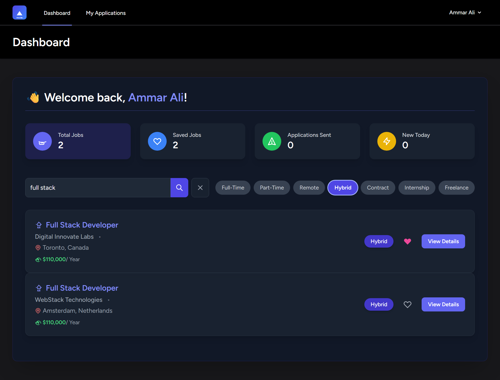
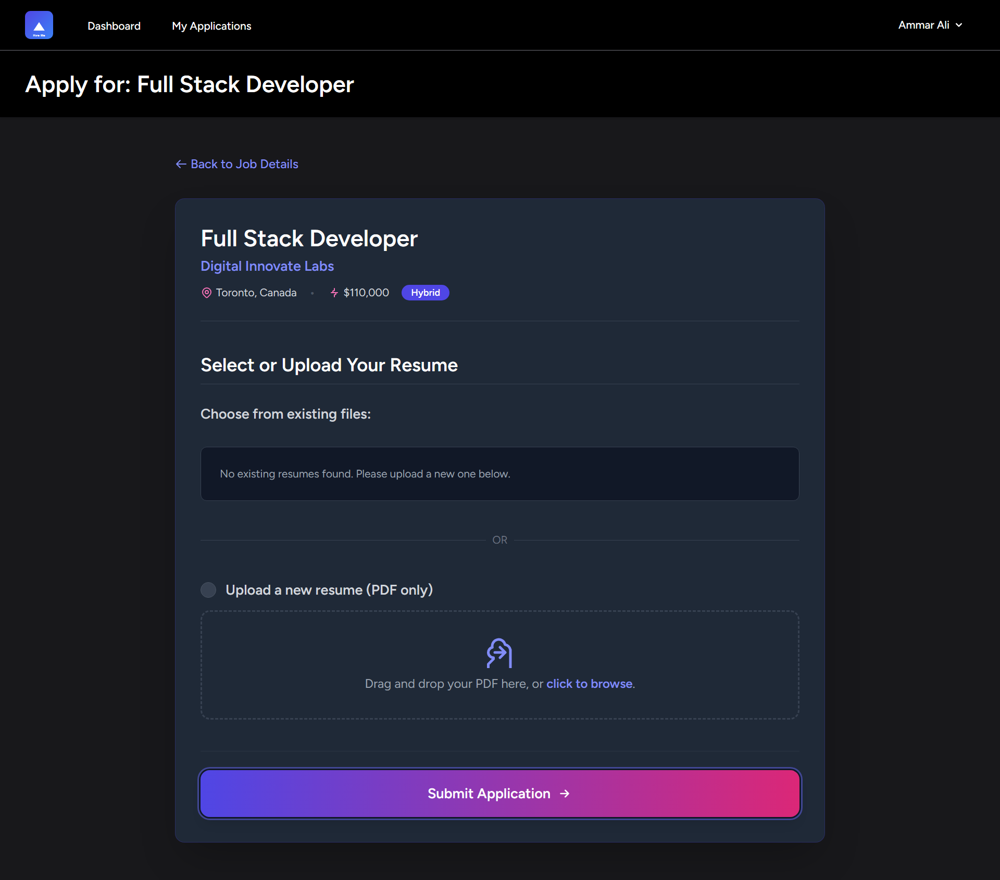
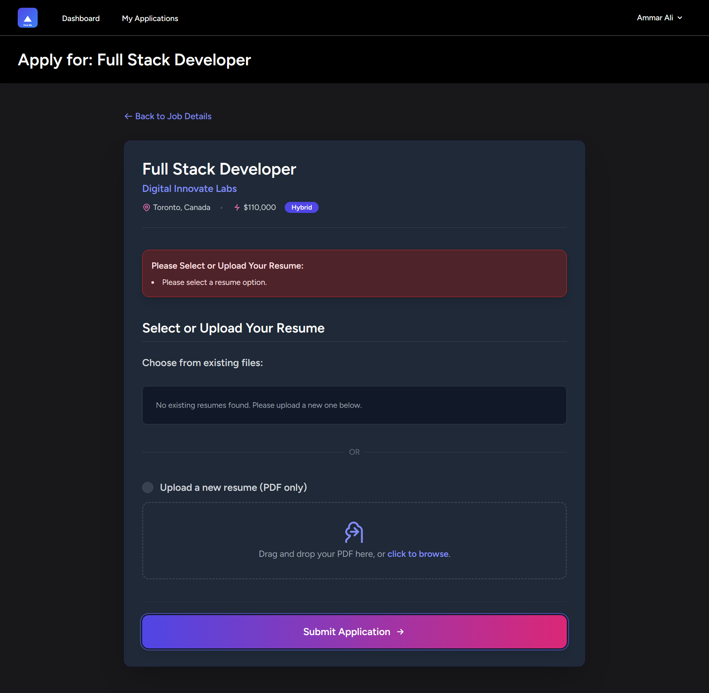
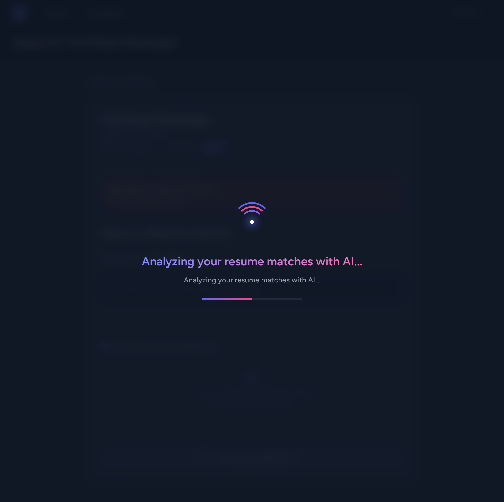
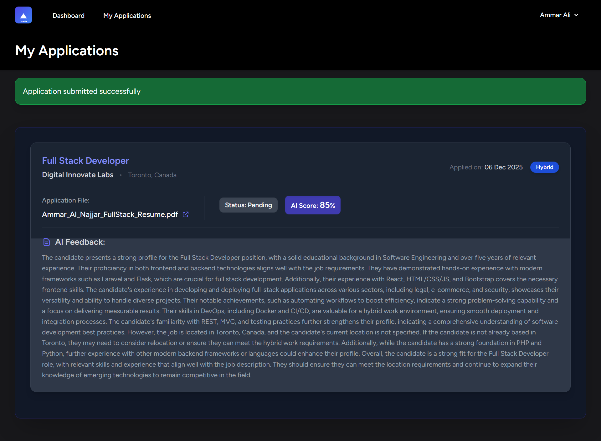
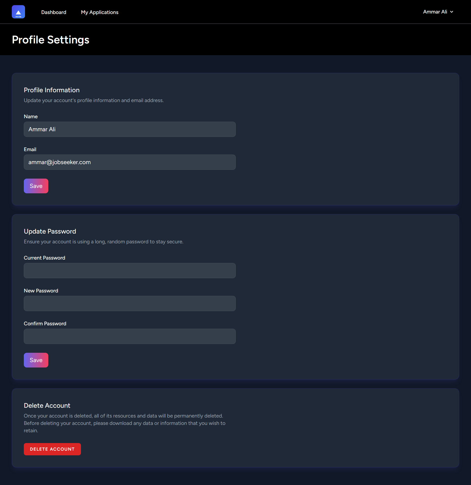

# Job Vacancies Platform (Job App)

<div align="center">



[](https://laravel.com)
[](https://php.net)
[](https://tailwindcss.com)
[](https://alpinejs.dev)

</div>


- [Live Demo](https://job-app-mbe9k.ondigitalocean.app/)

---

## 📋 Table of Contents

- [Introduction](#-introduction)
- [Key Features](#-key-features)
- [Project Interfaces](#-project-interfaces)
- [Project Structure](#-project-structure)
- [System Requirements](#-system-requirements)
- [Installation & Setup](#-installation--setup)
- [Technologies Used](#-technologies-used)
- [Contribution](#-contribution)
- [Common Issues](#-common-issues)
- [Support](#-support)

---

## 🚀 Introduction

**Job App** is the public-facing portal of the Job Vacancies Platform, designed to provide a seamless and modern experience for job seekers. It simplifies the process of finding and applying for jobs while leveraging AI for smarter application processing.

The system is built to provide:
- **Simplicity**: A clean, distraction-free interface for browsing jobs.
- **Speed**: Optimized performance for quick searches and applications.
- **Intelligence**: Integrated AI tools for resume parsing and analysis.

---

## ✨ Key Features

This platform offers a user-centric set of tools for candidates:

### 🧑‍💼 Candidate Experience
- **Smart Job Search**: Filter vacancies by category, location, and type.
- **Seamless Application**: Easy-to-use form for submitting applications.
- **Resume Parsing**: Automatically extracts details from PDF resumes using AI.
- **Responsive Design**: Fully functional on mobile and desktop devices.
- **Multilingual Support**: Ready for localization to reach a wider audience.

---

## 🖼 Project Interfaces

The interface is designed with a focus on **accessibility** and **modern aesthetics**.

### 1. The Gateway to Opportunities
**Landing Page**  
A visually striking and clean entry point that invites users to explore their career potential. It features a bold "Find your Dream Job" headline and intuitive navigation, setting a professional tone from the first interaction.  


### 2. Seamless Onboarding
**Login & Registration**  
Minimalist, distraction-free forms for user entry. The design focuses on ease of use with clearly labeled fields for account creation and secure login, ensuring a smooth onboarding experience for new candidates.  
<div align="center">
  
  
</div>

### 3. Personal Control Center
**Candidate Dashboard**  
A robust hub for job seekers to manage their activities. It provides an immediate overview of total jobs, saved positions, and application status, all presented through elegant summary cards and a searchable job list.  


### 4. Deep Dive into Opportunities
**Job Vacancy Details**  
A dedicated page providing comprehensive information about a position. It features a clean layout with salary details, company info, and requirements, helping candidates make informed decisions.  


### 5. Streamlined Application Process
**Apply, Review, Success**  
The application flow is broken down into intuitive steps. Starting with a clear form for personal details and resume upload, followed by a review state, and concluding with a reassuring success message. This ensures candidates feel confident at every step.  
<div align="center">
  
  
  
</div>

### 6. Activity Tracking
**My Applications**  
A dedicated view for candidates to track the status of their submitted applications. The clear table layout allows for quick status checks (e.g., Pending, Interview) and reviewing past submissions.  


### 7. User Management
**Profile Settings**  
A secure area for users to update their personal information and credentials. The clean form design ensures that maintaining profile accuracy is quick and hassle-free.  


---

## 📂 Project Structure

The project follows a standard scalable **Laravel** architecture:

```
job-app/
├── app/
│   ├── Http/Controllers/    # Request handling logic (Jobs, Applications)
│   ├── Models/              # Eloquent models (Job, Application)
│   └── Services/            # Business logic (ResumeParsingService)
├── resources/
│   ├── css/                 # Tailwind CSS entry points
│   ├── js/                  # Alpine.js logic and scripts
│   └── views/               # Blade templates for the UI
├── routes/
│   ├── web.php              # Web routes definition
├── database/
│   ├── migrations/          # Database schema definitions
│   └── seeders/             # Dummy data generators
└── public/                  # Publicly accessible assets
```

---

## 💻 System Requirements

Before setting up the project, ensure your environment meets the following prerequisites:

- **PHP**: >= 8.2
- **Composer**: Latest version
- **Node.js**: >= 18.x & **NPM**
- **Database**: MySQL 8.0+ or MariaDB 10+
- **Web Server**: Nginx or Apache (or Laravel Sail/Valet)

---

## ⚙️ Installation & Setup

Follow these steps to get the project running locally.

### 1. Clone the Repository
```bash
git clone https://github.com/your-username/job-app.git
cd job-app
```

### 2. Install Dependencies
Install PHP and Node.js dependencies:
```bash
composer install
npm install
```

### 3. Environment Configuration
Copy the example environment file and configure your database and API keys:
```bash
cp .env.example .env
nano .env
```
*Update `DB_DATABASE`, `OPENAI_API_KEY`, and `AWS_ACCESS_KEY_ID` (if using S3).*

### 4. Generate Application Key
```bash
php artisan key:generate
```

### 5. Database Setup
Run migrations to set up the schema:
```bash
php artisan migrate
```

### 6. Build Assets
Compile the frontend assets:
```bash
npm run build
```

### 7. Run the Application
Start the local development server:
```bash
php artisan serve
```
Visit `http://localhost:8000` in your browser.

---

## 🛠 Technologies Used

We chose this stack for its **reliability**, **performance**, and **innovation**.

| Technology | Purpose |
|------------|---------|
| **Laravel 12** | Robust PHP framework for backend logic and routing. |
| **Tailwind CSS** | Utility-first CSS framework for rapid, custom UI design. |
| **Alpine.js** | Lightweight JavaScript framework for interactive frontend components. |
| **OpenAI API** | AI-powered resume parsing and analysis. |
| **Spatie PDF-to-Text** | Efficient extraction of text from uploaded documents. |
| **Job Shared** | Custom library used to centralize Models and Enums across the platform. |
| **Vite** | Next-generation frontend tooling for fast builds. |

---

## 🤝 Contribution

We welcome contributions! Please follow these steps to participate:

1. **Fork** the repository.
2. **Create a Branch** for your feature (`git checkout -b feature/AmazingFeature`).
3. **Commit** your changes (`git commit -m 'Add some AmazingFeature'`).
4. **Push** to the branch (`git push origin feature/AmazingFeature`).
5. **Open a Pull Request**.

Please ensure your code follows the project's coding standards (PSR-12).

---

## ❓ Common Issues

### 1. Permission Denied (Storage)
If you encounter permission errors:
```bash
chmod -R 775 storage bootstrap/cache
```

### 2. Database Connection Refused
- Ensure your database server is running.
- Verify credentials in `.env`.

### 3. Vite Manifest Not Found
Run `npm run build` to generate the manifest file.

---

## 💡 Feedback & Tips

- **Security**: Never commit your `.env` file or expose your API keys.
- **Performance**: Use `php artisan route:cache` and `config:cache` in production.
- **Issues**: Report bugs via the GitHub Issues tab.

---

<p align="center">Developed by ❤️ Engineer Ammar Al-Najjar</p>
